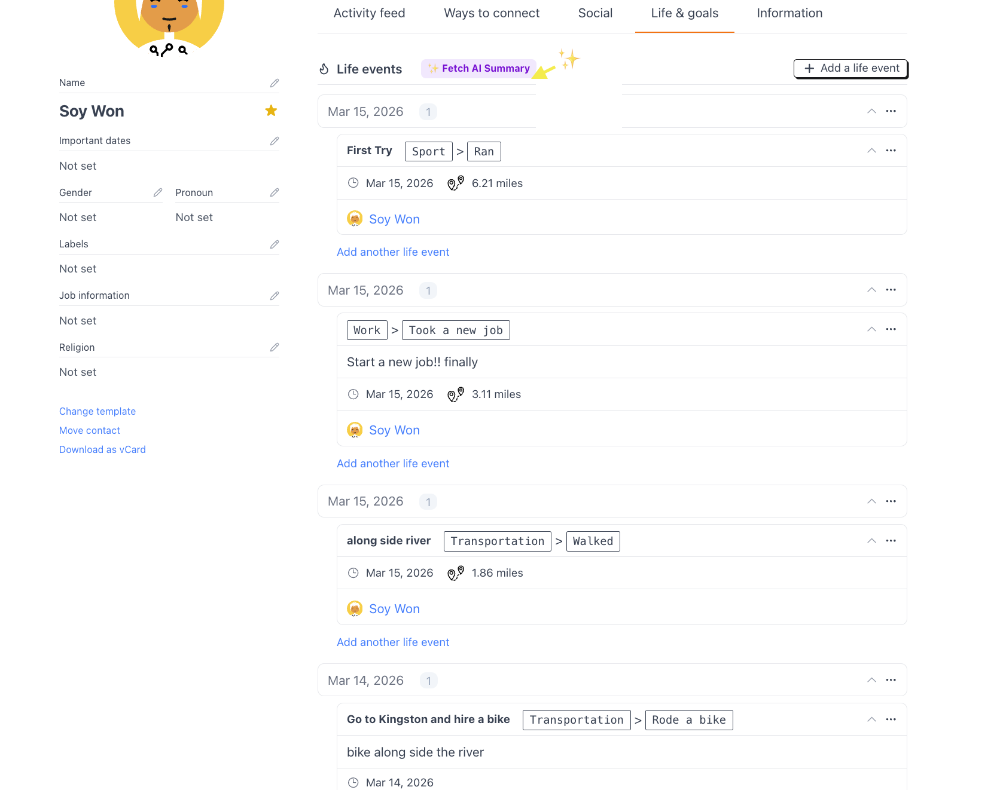
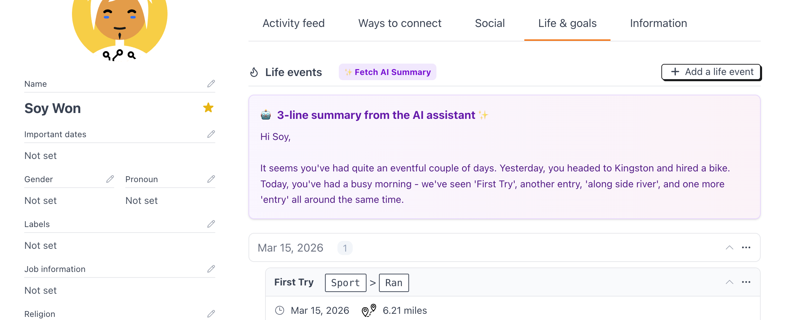

# 🤖 Monica PRM + AI Summary Engine (Fork)

> **Document your life with the power of LLMs.** > This is a customized version of [MonicaHQ/Monica](https://github.com/monicahq/monica), featuring an experimental **AI Life Event Summary** engine.

---

## ✨ What's New? (Soy's Customization)

While the original Monica is a "dumb assistant" (by design), I've integrated Groq AI (LLaMA 3.1) to transform scattered life logs into meaningful 3-line insights.

### 1. AI Life Event Summary

- **The Problem:** As life events pile up, it's hard to get a quick "vibe" of how someone has been lately.
- **The Solution:** A one-click AI summary that reads recent timeline events and provides a friendly, concise overview.
- **Tech Stack:** Laravel (Backend) + Vue.js (Frontend) + Cloud API (AI).

### 2. Preview

**Step 1: Click the Magic Button**

  

**Step 2: Get AI Insights**

  

---

### 🛠 Technical Highlights

- **API Design:** Created a **RESTful API** endpoint: `/api/contacts/{id}/summary`.
- **Performance:** Optimized database queries using Eager Loading to prevent N+1 issues.
- **Domain Logic:** Maintained the project's existing Action Pattern while fixing field mapping bugs.
- **Frontend (Vue.js)** Developed a reactive UI component in `LifeEvent.vue`.

---

## 🔗 Original Project

This project is based on the amazing work by the Monica team.

- **Original Repository:** [https://github.com/monicahq/monica](https://github.com/monicahq/monica)
- **Status:** This fork is for experimental/educational purposes.

---
